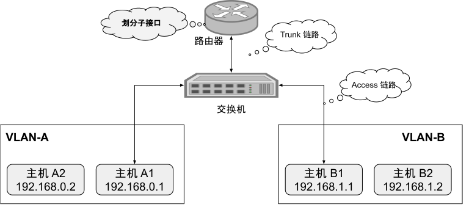
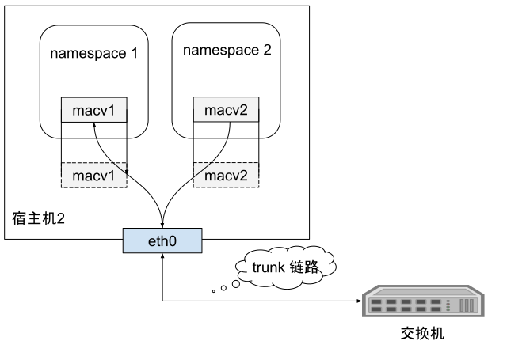

# 3.5.5 MACVLAN

再补充一下 VLAN 之间的通信逻辑，我们就有足够的前置知识了解最后一种虚拟设备 MACVLAN 了。

## 1. VLAN 通信逻辑

两个 VLAN 之间位于独立的广播域，是完全二层隔离的，通信就只能通过三层设备。

假设位于 VLAN-A 中的主机 A1，希望把数据包发送给 VLAN-B 中的主机 B1，由于 A、B 两个 VLAN 之间二层链路不通，因此引入了单臂路由。单臂路由不属于任何 VLAN，它与交换机之间的链路允许任何 VLAN ID 的数据包通过，交换机之间互联用的端口也被称为 TRUNK 端口。

:::center
   
 图 3-27 两个 VLAN 之间使用单臂路由模式通信
:::

这样，A1 要和 B2 通信，A1 就把数据包先发送给路由（只需把路由设置为网关即可做到），然后路由根据数据包上的 IP 地址得知 B1 的位置，去掉 VLAN-A 的 VLAN Tag，改用 VLAN-B 的 VLAN Tag 重新封装数据包后，发回给交换机，交换机收到后就可以顺利转发给 B1 了。由于 A1、B2 各自处于独立的网段上，它们又各自要把同一个路由作为网关使用，这就要求路由器必须同时具备 192.168.0.0/24 和 192.168.1.0/24 的 IP 地址。

当然，如果真的就只有 VLAN-A、VLAN-B 两个 VLAN，那把路由器上的两个接口分别设置不同的 IP 地址，然后用两条网线分别连接到交换机上，也勉强算是一个解决办法。

但要知道，VLAN 最多可以支持 4096 个 VLAN，那如果要接四千多条网线就太离谱了。

为了解决这个问题，802.1Q 规范中专门定义了子接口（Sub-Interface）的概念，它的作用是允许在同一张物理网卡上，针对不同的 VLAN 绑定不同的 IP 地址。

## 2. MACVLAN

MACVLAN 借用了 VLAN 子接口的思路，并且在这个基础上更进一步，不仅允许对同一个网卡设置多个 IP 地址，还允许对同一张网卡上设置多个 MAC 地址，这也是 MACVLAN 名字的由来。

原本 MAC 地址是网卡接口的“身份证”，应该是严格的一对一关系，而 MACVLAN 打破了这层关系。方法就是在物理设备之上、网络栈之下生成多个虚拟的 Device，每个 Device 都有一个 MAC 地址，新增 Device 的操作本质上相当于在系统内核中，注册了一个收发特定数据包的回调函数，每个回调函数都能对一个 MAC 地址的数据包进行响应，当物理设备收到数据包时，会先根据 MAC 地址进行一次判断，确定交给哪个 Device 来处理。

:::center
   
 图 3-28 MACVLAN 工作原理
:::

用 MACVLAN 技术虚拟出来的副本网卡，在功能上和真实的网卡是完全对等的，此时真正的物理网卡实际上也确实承担着类似交换机的职责。在收到数据包后，物理网卡会根据目标 MAC 地址，判断这个包应该转发给哪块副本网卡处理（如图 3-28 所示），由同一块物理网卡虚拟出来的副本网卡，天然处于同一个 VLAN 之中，因此可以直接二层通信，不需要将流量转发到外部网络。

MACVLAN 本身跟 VLAN 没什么关系，如果不考虑虚拟化的概念，甚至可以理解为一个物理机插了多个网卡。但在容器里面通常跟 VLAN 结合使用（因为一个宿主机的上百个容器可能属于不同的 VLAN）。

如图 3-29 所示，一台宿主机上面可以虚拟出多块 VLAN 网卡，宿主机和交换机的链路在 trunk 模式下，同一链路根据不同报文内的 vlanID 如（10、20、30）组成逻辑信道，互不干扰。

:::center
   
 图 3-29 MACVLAN 二层网络
:::

由于不需要创建 Linux Bridge，而是直接通过接口连接到物理网络。因此，MACVLAN 是 VM 或容器组建虚拟集群网络最理想的方案。
