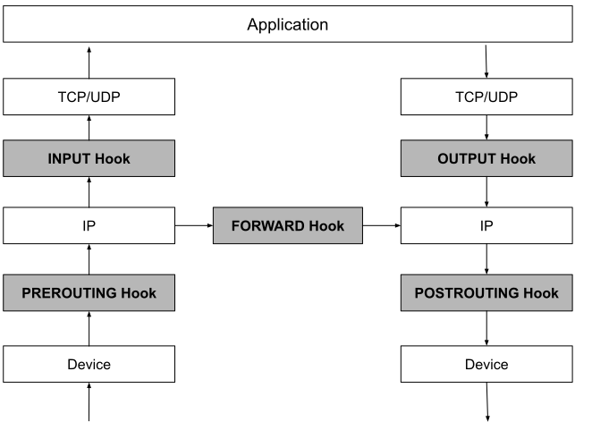

# 3.3.1 Netfilter 的 5 个钩子

Netfilter 干预 Linux 网络通信的方式，是围绕网络协议栈（主要在网络层）埋下了 5 个钩子（也称 hook）[^1]。内核中的其他模块（如 iptables、IPVS 等）可以向这些钩子注册回调函数。当数据包进入网络层，经过这些钩子时，就会自动触发注册在这里的钩子函数，从而对数据包进行各种干预处理。这 5 个钩子的名称与含义如下：

- PREROUTING：只要数据包从设备（如网卡）那里进入到协议栈，就会触发该钩子。当我们需要修改数据包的 “Destination IP” 时，会使用到它，即 PREROUTING 钩子主要用于目标网络地址转换（DNAT，Destination NAT）。
- FORWARD：顾名思义，指转发数据包。前面的 PREROUTING 钩子并未经过 IP 路由，不管数据包是不是发往本机的，全部照单全收。但经过 IP 路由后，如果发现数据包不是发往本机，则会触发 FORWARD 钩子进行处理。此时，本机就相当于一个路由器，作为网络数据包的中转站，FORWARD 钩子的作用就是处理这些被转发的数据包，以此来保护其背后真正的“后端”机器。
- INPUT：如果发现数据包是发往本机的，则会触发本钩子。INPUT 钩子一般用来加工发往本机的数据包，当然也可以做数据过滤，从而保护本机的安全。
- OUTPUT：数据包送达到应用层处理后，会把结果送回请求端，在经过 IP 路由之前，会触发该钩子。Output 钩子 一般用于加工本地进程输出的数据包，同时也可以限制本机的访问权限，比如发往 www.example.org 的数据包都丢弃掉。
- POSTROUTING：数据包出协议栈之前，都会触发该钩子，无论这个数据包是转发的，还是经过本机进程处理过的。POSTROUTING 钩子 一般用于源网络地址转换（SNAT，Source NAT）。

这 5 个钩子在网络协议栈的位置如图 3-2 所示。

:::center
   
  图 3-2 Netfilter 的 5 个钩子
:::

Netfilter 允许在同一个钩子处，注册多个回调函数。因此向钩子注册回调函数必须明确优先级，以便按照明确的优先顺序触发回调函数。因为回调函数有多个，如果把这些回调函数串起来，就构成了一条链，我们将其称为回调链（Chained Callbacks）。这个设计影响了围绕 Netfilter 构建的上层应用基本都带有“链”的概念，例如稍后介绍的 iptables。
换、封包处理、地址伪装、基于协议的连接跟踪、数据包过滤、透明代理、带宽限速以及访问控制等，都是在 Netfilter 基础上实现的。

[^1]: hook 设计模式在其他软件系统中随处可见，如本书后面介绍的 eBPF、Kubernetes 等等，Kubernetes 在编排调度、网络、资源定义等通过暴露接口的方式，允许用户根据自己的需求插入自定义代码或逻辑来扩展 Kubernetes 的功能。 