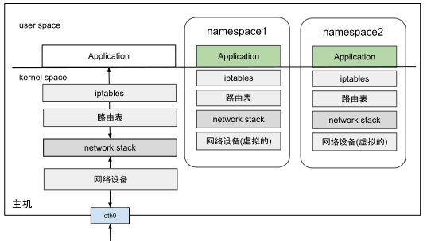

# 3.5.1 网络命名空间

Linux 内核从 2.4.19 版本起，开始逐步集成多种命名空间技术，以实现对各类资源的隔离。网络命名空间（Network Namespace）是其中最关键的一种，它是各类容器化技术的核心。

有了网络命名空间技术，Linux 系统便能够在一个主机内创建多个独立的网络环境。每个网络命名空间都拥有自己独立的网络资源，包括防火墙规则、网络接口、路由表、ARP 邻居表以及完整的网络协议栈。当一个进程运行在网络命名空间内时，感觉就像独享一台物理主机一样。

:::center
  <br/>
 图 3-12 不同网络命名空间内的网络资源都是隔离的
:::

Linux ip 工具的子命令 netns 集成了网络命名空间的增删查改功能。笔者使用 ip 命令演示操作网络命名空间，帮助你加深理解网络命名空间的隔离性。

首先，创建一个名为 ns1 的网络命名空间。命令如下所示：

```bash
$ ip netns add ns1
```

查询该网络命名空间内的网络设备信息。由于没有经过任何配置，因此该网络命名空间内只有一个名为 lo 的本地回环设备，且该设备的状态为 DOWN。

```bash
$ ip netns exec ns1 ip link list 
1: lo: <LOOPBACK> mtu 65536 qdisc noop state DOWN mode DEFAULT group default qlen 1000
    link/loopback 00:00:00:00:00:00 brd 00:00:00:00:00:00
```

继续查看该网络命名空间下 iptables 规则配置。由于这是一个初始化的网络命名空间，因此它也并没有任何 iptables 规则。

```bash
$ ip netns exec ns1 iptables -L -n
Chain INPUT (policy ACCEPT)
target     prot opt source               destination         

Chain FORWARD (policy ACCEPT)
target     prot opt source               destination         

Chain OUTPUT (policy ACCEPT)
target     prot opt source               destination 
```

不同的网络命名空间之间是相互隔离的，那它们如果想与外界通信（其他网络命名空间、宿主机），该怎么处理呢？我们先看看物理机是怎么操作的：一台物理机如果要想与外界进行通信，那得插入一块网卡，通过网线连接到以太网交换机，加入一个局域网内。

被隔离的网络命名空间如果想与外界进行通信，就需要利用到稍后介绍的各类虚拟网络设备。也就是在网络命名空间里面插入“虚拟网卡”，然后把“网线”的另一头桥接到“虚拟交换机”中。没错，这些操作完全和物理环境中的局域网配置一样，只不过全部是虚拟的、用代码实现的而已。