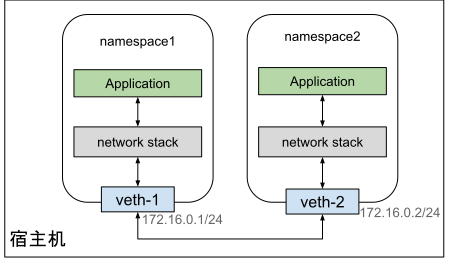

# 3.5.2 虚拟网络设备 TUN/TAP 和 Veth

## 1. 虚拟网络设备 tun 和 tap

TUN 和 TAP 是Linux 内核 2.4.x 版本之后引入的虚拟网卡设备，是一种让用户空间可以和内核空间双向传输数据包的虚拟网络设备。这两种设备的区别与含义为：
- tun 设备是一个三层网络层设备，从 /dev/net/tun 字符设备上（稍后介绍）读取的是 IP 数据包，写入的也只能是 IP 数据包，因此常用于一些点对点IP隧道，例如OpenVPN，IPSec等；
- tap 设备是二层链路层设备，等同于一个以太网设备，从 /dev/tap0 字符设备上读取 MAC 层数据帧，写入的也只能是 MAC 层数据帧，因此常用来作为虚拟机模拟网卡使用；

在 Linux 中，内核空间和用户空间之间数据传输有多种方式，字符设备是其中一种。所以 TAP/TUN 都具有相应的字符设备，用于实现内核空间和用户空间之间传输数据。TAP/TUN 对应的字符设备文件分别为：
- TAP：/dev/tap0；
- TUN：/dev/net/tun。

当用户空间的程序 open() 一个字符设备文件时，会返回一个 fd 句柄，同时字符设备驱动就会创建并注册相应的虚拟网卡网络接口，并以 tunX 或 tapX 命名。当用户空间的程序向 fd 执行 read()/write() 时，就可以和内核网络协议栈读写数据了。

TUN 和 TAP 的工作方式基本不同，只是两者工作的层面不一样。以使用 TUN 设备建立的 VPN 隧道为例（如图 3-20）：普通的用户程序发起一个网络请求，数据包进入内核协议栈时查找路由，下一跳是 tunX 设备。tunX 发现自己的另一端由 VPN 程序打开，所以收到数据包后传输给 VPN 程序。VPN 程序对数据包进行封装操作，“封装”是指将一个数据包包装在另一个数据包中，就像将一个盒子放在另一个盒子中一样。封装后的数据再次被发送到内核，最后通过 eth0 接口（也就是图中的物理网卡）发出。

:::center
  <br/>
 图 3-20 VPN 中数据流动示意图
:::

将一个数据包封装到另一个数据包的处理方式被称为 “隧道”，隧道技术是构建虚拟逻辑网络的经典做法。容器网络解决方案 Flannel 的 UDP 模式曾使用 TUN 设备实现容器间隧道网络，但使用 TUN 设备传输数据需要经过两次协议栈，且有多次的封包/解包过程，产生额外的性能损耗。这也是后来 Flannel 弃用 UDP 模式的原因。

## 2. 虚拟网卡 Veth

Linux 内核 2.6 版本支持网络命名空间的同时，也提供了专门的虚拟网卡 Veth（Virtual Ethernet，虚拟以太网网卡），用来支持隔离的网络命名空间与外界进行通信。

我们可以把 Veth 理解成带着两个“水晶头”的一根“网线”，从网线的一头发送数据，另一头就会收到数据。因此 Veth 也被说成是一对设备（称作 Veth-pair）。

Veth 典型的使用例子是，实现隔离的网络命名空间之间的互联，以及 Linux Bridge 和 Open vSwitch（OVS）等虚拟交换机的连接。我们在 Kubernetes 集群中查看网卡设备，总能看到一堆 Veth 开头的设备信息，这些就是为不同 Pod 之间通信而创建的虚拟网卡。

```plain
$ ip addr
7: veth9c0be5b3@if2: <BROADCAST,MULTICAST,UP,LOWER_UP> mtu 1450 qdisc noqueue master cni0 state UP group default 
    link/ether e2:7c:c8:36:d7:14 brd ff:ff:ff:ff:ff:ff link-netnsid 2
    inet6 fe80::e07c:c8ff:fe36:d714/64 scope link 
       valid_lft forever preferred_lft forever
```

假设我们已经有两个相互隔离的网络命名空间 net1 和 net2，下面笔者进行操作演示，看看如何通过 veth 实现这网络命名空间的互通。

1. 创建一对名为 veth1 和 veth2 的 veth 接口。

```bash
$ ip link add veth1 type veth peer name veth2
```

2、 接下来，要做的是把这对 veth pair 分别放到 net1 和 net2 中，这个可以使用 ip link set DEV netns NAME 来实现。

```bash
$ ip link set veth1 netns net1
$ ip link set veth2 netns net2
```
3. 接下来，我们再给这对 veth pair 配置上 ip 地址，并启用它们。

```bash
$ ip netns exec net1 ip link set veth1 up
$ ip netns exec net1 ip addr add 172.16.0.1/24 dev veth1
$ ip netns exec net1 ip route
172.16.0.0/24 dev veth1  proto kernel  scope link  src 172.16.0.1

$ ip netns exec net2 ip link set veth2 up
$ ip netns exec net2 ip addr add 172.16.0.2/24 dev veth2
```

可以看到，每个网络命名空间中，在配置完 ip 之后，还自动生成了对应的路由表信息：网络 172.16.0.0/24 数据报文都会通过 veth pair 进行传输。

完成以上的操作，我们创建的网络拓扑结构如下所示。

:::center
  <br/>
 图 3-21 Veth 设备对
:::

4. 最后，我们 ns1 中进行 ping 测试，可以看到两个命名空间是联通的了。

```bash
$ ip netns exec ns1 ping -c10 172.16.0.2
PING 172.16.0.2 (172.16.0.2) 56(84) bytes of data.
64 bytes from 172.16.0.2: icmp_seq=1 ttl=64 time=0.121 ms
64 bytes from 172.16.0.2: icmp_seq=2 ttl=64 time=0.063 ms
```

虽然 Veth 模拟网卡直连的方式解决了两个容器之间的通信问题，然而对多个容器间通信，如果只用 Veth 的话，事情就会变得非常麻烦，让每个容器都为与它通信的其他容器建立一对专用的 Veth Pair，根本不切实际。

此刻，就迫切需要有一台虚拟化的交换机，来解决多容器之间的通信问题，这就是我们前面多次提到的 Linux Bridge。

