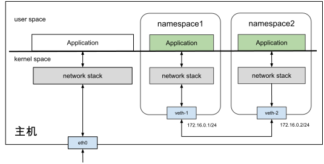

# 3.5.3 虚拟网卡 Veth

Linux 内核 2.6 版本支持网络命名空间的同时，也提供了专门的虚拟网卡 Veth（Virtual Ethernet，虚拟以太网网卡）。

Veth 的核心原理是“反转数据传输方向”，即在内核中，将发送端的数据包转换为接收端的新数据包，并重新交由内核网络协议栈处理。通俗的解释，Veth 就是一根带着两个“水晶头”的“网线”，从网线的一头发送数据，另一头就会收到数据。因此，Veth 也被说成是“一对设备”（Veth-Pair）。

Veth 设备的典型应用场景是连接相互隔离的网络命名空间，使它们能够进行通信。假设存在两个网络命名空间 ns1 和 ns2，其网络拓扑结构如图 3-14 所示。接下来，笔者将通过实际操作演示 Veth 设备如何在网络命名空间之间建立通信，帮助你加深理解。

:::center
  <br/>
 图 3-14 Veth 设备对
:::

首先，使用以下命令创建一对 Veth 设备，命名为 veth1 和 veth2。该命令会生成一对虚拟以太网设备，它们之间形成点对点连接，即数据从 veth1 发送后，会直接出现在 veth2 上，反之亦然。

```bash
$ ip link add veth1 type veth peer name veth2
```

接下来，我们将分别将它们分配到不同的网络命名空间。

```bash
$ ip link set veth1 netns ns1
$ ip link set veth2 netns ns2
```

Veth 作为虚拟网络设备，具备与物理网卡相同的特性，因此可以配置 IP 和 MAC 地址。接下来，我们为 Veth 设备分配 IP 地址，使其处于同一子网 172.16.0.0/24，然后激活设备。

```bash
# 配置命名空间1
$ ip netns exec ns1 ip link set veth1 up
$ ip netns exec ns1 ip addr add 172.16.0.1/24 dev veth1
# 配置命名空间2
$ ip netns exec ns2 ip link set veth2 up
$ ip netns exec ns2 ip addr add 172.16.0.2/24 dev veth2
```
Veth 设备配置 IP 后，每个网络命名空间都会自动生成相应的路由信息。如下所示：

```bash
$ ip netns exec ns1 ip route
172.16.0.0/24 dev veth1  proto kernel  scope link  src 172.16.0.1
```

上述路由配置表明，所有属于 172.16.0.0/24 网段的数据包都会经由 veth1 发送，并在另一端由 veth2 接收。在 ns1 中执行 ping 测试，可以验证两个网络命名空间已经成功互通了。

```bash
$ ip netns exec ns1 ping -c10 172.16.0.2
PING 172.16.0.2 (172.16.0.2) 56(84) bytes of data.
64 bytes from 172.16.0.2: icmp_seq=1 ttl=64 time=0.121 ms
64 bytes from 172.16.0.2: icmp_seq=2 ttl=64 time=0.063 ms
```

最后，虽然 Veth 设备模拟网卡直连的方式解决了两个容器之间的通信问题，但面对多个容器间通信需求，如果只用 Veth 设备的话，事情就会变得非常麻烦。让每个容器都为与它通信的其他容器建立一对专用的 Veth 设备，根本不切实际。此时，就迫切需要一台虚拟化交换机来解决多容器之间的通信问题，这正是笔者前面多次提到的 Linux bridge。

