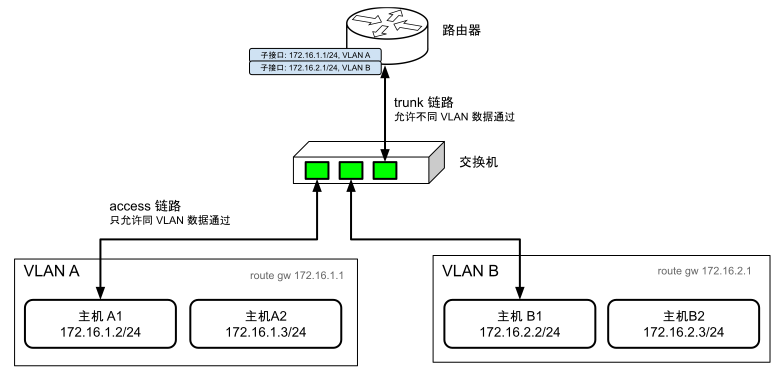

# 3.5.5 虚拟网络通信技术 VXLAN

基于物理设备实现的“原生”网络拓扑结构相对固定，很难跟得上云原生时代下系统频繁变动的频率。例如，容器的动态扩缩容、集群跨数据中心迁移等等，都要求网络拓扑随时做出调整。正因为如此，软件定义网络（Software Defined Networking，SDN）的需求变得前所未有的迫切。

SDN 的核心思想是在现有物理网络之上构建一层虚拟网络，通过解耦控制平面（操作系统和网络控制软件）与数据平面（物理设备和通信协议），将网络服务从底层硬件中抽象出来，使其能够通过软件编程直接控制。

SDN 网络模型如图 3-16 所示，它由两个部分组成。
- **Underlay 网络**（底层网络）：由路由器、交换机等硬件设备组成的物理网络，负责底层数据传输。
- **Overlay 网络**（覆盖网络）：基于网络虚拟化技术构建在 Underlay 之上的逻辑网络，实现虚拟机、容器等计算资源之间的互联。

:::center
  <br/>
  图 3-16 SDN 网络中 Overlay 与 Underlay 网络模型
:::

SDN 的发展早于云原生十余年，在此过程中涌现出多种 Overlay 网络实现方案，如 Geneve（Generic Network Virtualization Encapsulation）、VXLAN（Virtual Extensible LAN）、STT（Stateless Transport Tunneling）等。这些技术本质上都是隧道技术，即通过“在现有物理网络上封装数据包，创建虚拟网络”。

在虚拟网络中，容器无需关注底层物理网络的路由规则，而物理网络也无需针对容器 IP 进行专门的路由配置。因此，以 VXLAN 为代表的 Overlay 网络，作为一种无需修改底层网络即可实现容器互联的方案，快速在容器领域铺开了。

学习 VXLAN 之前，有必要充分了解一些物理网络通信的基本原理。接下来，笔者将先介绍 VXLAN 的前身 VLAN（Virtual Local Area Network，虚拟局域网）技术。

## 1. 虚拟局域网 VLAN

在以太网通信中，数据帧必须包含目标 MAC 地址才能正常传输。因此，计算机在通信前通常会先广播 ARP 请求，以获取目标 MAC 地址。但是，当一个广播域内设备非常多时，ARP、DHCP、RIP 等机制会产生大量的广播帧，很容易形成广播风暴。因此，VLAN 的核心职责是划分广播域，使每个 VLAN 形成独立的广播域，从逻辑上隔离同一物理网络中的设备。

举一个具体的例子。假设一个原始广播域使用网段 172.16.0.0/16，其默认情况下可以容纳 65,536 个 IP 地址（不包括保留地址）。若不进行划分，所有设备共享同一广播域，ARP 等广播流量可能引发严重的网络拥塞。如果将 172.16.0.0/16 划分为 255 个子网，每个子网对应 172.16.1.0/24、172.16.2.0/24、172.16.3.0/24，直到 172.16.255.0/24，每个子网的 VLAN ID 依次为 1、2、3 ... 255。这样，每个 VLAN 拥有独立的广播域，理论上可容纳 254 台终端，广播风暴的影响指数级下降。

VLAN 划分子网的方式是在以太帧报头中添加 VLAN Tag，使广播仅在相同 VLAN Tag 的设备间生效。支持 VLAN 的交换机可识别帧内的 VLAN ID，确保数据包仅在相同 VLAN 内转发。

VLAN 划分子网虽然能有效控制广播风暴，但在既需要隔离又希望部分主机互通的场景下，仅划分 VLAN 还不够，还需建立跨 VLAN 访问的通道。由于不同 VLAN 之间完全隔离，广播域不重叠，它们的通信必须依赖三层路由设备。

最简单的三层路由模式是通过单臂路由实现的。其网络拓扑如图 3-17 所示，路由器与交换机之间通过一条线路连接，称为 Trunk 链路。与之相对，主机与交换机之间的链路称为 Access 链路。Trunk 链路允许任何 VLAN ID 的数据包通过。当需要路由的数据包通过 Trunk 链路传输到路由器进行处理后，处理完的包会返回至交换机进行转发。所以大家给这种拓扑起了一个形象的名字 —— 单臂路由。

说白了，单臂路由就是从哪个口进去，再从哪个口出来，而不像传统网络拓扑中数据包通过不同接口进入和离开路由器。为了实现这种单臂路由模式，802.1Q 以太网规范定义了“子接口”（Sub-Interface）的概念，使得同一物理网卡可以绑定不同 VLAN 的 IP 地址。通过将各子网的默认网关配置为相应子接口的地址，路由器可以通过修改 VLAN 标签来实现不同 VLAN 之间的跨子网数据转发。

:::center
  <br/>
  图 3-17 VLAN 单臂路由原理
:::

VLAN 虽然通过划分子网来解决广播风暴，但它也有明显的缺陷：
- **VLAN Tag 设计缺陷**：当时的网络工程师完全未料及云计算会发展得会如此普及，只设计了 12 位 bit 存储 VLAN ID，因此最多只能支持 4,094 个 VLAN。对于大型数据中心或运营商网络，这个数量远远不够，很容易造成 VLAN ID 枯竭。
- **跨数据中心通信困难**：VLAN 是二层网络技术，而两个独立数据中心之间只能通过三层网络互通。这使得在云计算环境中，尤其是在业务跨多个数据中心部署时，传递 VLAN Tag 成为一种麻烦的工作。特别是在容器化环境中，一台物理机上可能运行数百个容器，每个容器都有独立的 IP 和 MAC 地址，这给路由器、交换机等设备带来了巨大的压力。

## 2. 虚拟可扩展局域网 VXLAN

为了解决 VLAN 的设计缺陷，IETF 定义了 VXLAN（Virtual eXtensible Local Area Network，虚拟可扩展局域网）规范。虽然从名字上看，VXLAN 似乎是 VLAN 的一种扩展协议，但实际上，它与 VLAN 在设计理念和实现方式上有着本质的不同。

VXLAN 属于 NVO3（Network Virtualization over Layer 3，三层虚拟化网络）的标准技术规范之一，采用隧道封装技术。其基本原理是通过“封装/解封”手段，将二层（L2）以太网帧封装到四层（L4）UDP 报文中，并在三层（L3）网络中进行传输。这样，不同数据中心节点之间的通信便如同在同一广播域内进行，从而解决了传统 VLAN 面临的扩展性和跨数据中心通信的限制。

根据图 3-18，我们可以看到 VXLAN 报文如何封装原始的以太网帧（图中的 Original Layer2 Frame）：

- **VXLAN Header**：包含 24 位的 VNI（VXLAN Network Identifier）字段，用于定义 VXLAN 网络中的不同租户，支持的最大数量为 1,677 万个。
- **UDP Header**：在 UDP 头中，目的端口号（图中的 VXLAN Port）固定为 4789，源端口随机分配。
- **Outer IP Header**：封装目的 IP 地址和源 IP 地址，这里 IP 指的是宿主机的 IP 地址。
- **Outer MAC Header**：封装源 MAC 地址，目的 MAC 地址，这里 MAC 地址指的是宿主机 MAC 地址。

:::center
  <br/>
  图 3-18 VXLAN 报文结构
:::


在 VXLAN 隧道网络中，负责“封装/解封”的设备被称为 VTEP 设备（VXLAN Tunnel Endpoints，VXLAN 隧道端点），在 Linux 系统中，它实际上是一个虚拟的 VXLAN 网络接口。当源服务器中的容器发送原始数据帧时，首先由起点的 VTEP 设备将其封装为 VXLAN 格式的报文，然后通过主机的 IP 网络传输到目标服务器的 VTEP 设备。目标服务器中的 VTEP 设备解封 VXLAN 报文，恢复原始数据帧，并将其转发到目标容器。


Linux 内核 3.12 版本开始支持完备的 VXLAN 技术，包括多播模式、单播模式和 IPv6 支持等功能。现在，在三层可达的网络环境中，无需专用硬件，简单配置下 Linux 系统，就可以构建 VXLAN 隧道网络。

以下是一个具体示例，展示了如何在 Linux 系统中配置 VXLAN 接口并将其与 Linux bridge 绑定。

```bash
# 创建一个 bridge
$ brctl addbr br0

# 创建一个 VXLAN 接口，VNI 为 100，指定使用 eth0 作为物理接口
$ ip link add vxlan100 type vxlan id 100 dev eth0 dstport 4789

# 将 VXLAN 接口加入 bridge
$ brctl addif br0 vxlan100

# 启动 bridge 和 VXLAN 接口
$ ip link set up dev br0
$ ip link set up dev vxlan100
```
通过上述配置，当 vxlan100 接口接收到数据包（通过 VXLAN 隧道传输而来）时：
- 首先，进行解封操作，移除 VXLAN 头部和 UDP 头部，提取原始的二层以太网帧；
- 然后，将原始二层以太网帧转发至名为 br0 的 Linux bridge，之后 Linux bridge 根据其连接的网络接口转发至某个网络命名空间。

:::center
  <br/>
  图 3-19 VXLAN 通信概览
:::

从上述分析可以看出，VXLAN 完美弥补了 VLAN 的不足：
- 首先，VXLAN 使用 24 位的 VNI 字段（如图 3-18 所示），理论上可支持超过 1,600 万个逻辑二层网络，远超 VLAN 的 4,094 个限制；
- 其次，VXLAN 本质上构建了跨越多个物理网络的“隧道”，通过将原始 Layer 2（以太网）帧封装在 Layer 3（IP 网络）中进行传输，实现不同物理网络之间的通信，犹如处于同一个广播域。无论虚拟机或容器迁移到 VLAN B 还是 VLAN C，它们仍然处于同一个二层网络中，网络层配置无需调整。

VXLAN 具备高灵活性、可扩展性和易于管理的特点，已成为构建数据中心及容器网络的主流技术。绝大多数公有云的 VPC（虚拟私有云）及容器网络均采用 VXLAN 技术构建大型二层网络。在本书第七章的 7.6 节中，笔者将以容器网络解决方案 Flannel 的 VXLAN 模式为例，详细阐述容器网络通信的过程及原理。