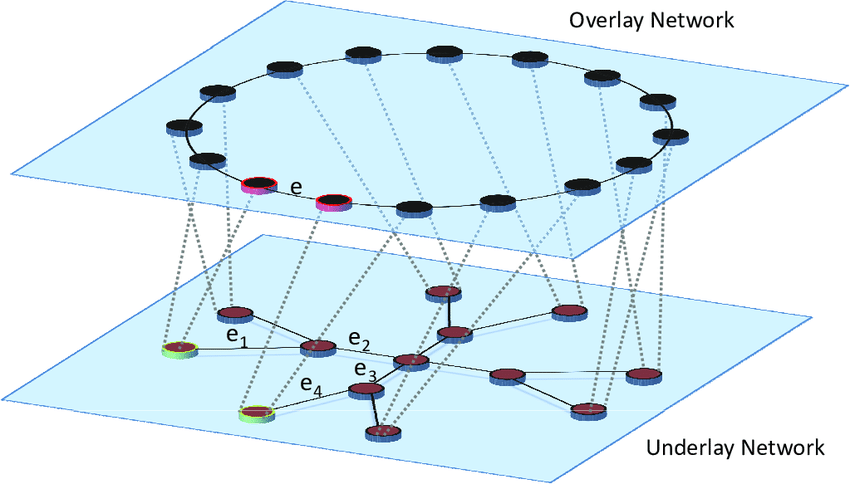

# 3.5.5 虚拟网络通信技术

容器分布在不同的物理主机之上，每一台物理主机都有物理网络互相联通，然而基于物理网络的拓扑结构是相对固定的，很难跟得上云原生时代分布式系统频繁变动的频率。例如容器的动态扩缩容、集群跨数据中心迁移等等，都要求网络拓扑随时做出调整。正因为如此，软件定义网络（Software Defined Networking，SDN）的需求变得前所未有的迫切。

SDN 的核心思想是在现有的物理网络之上再新增一层虚拟网络，将控制平面（操作系统和各类软件）和数据平面（交换机和各类通信协议等）解耦，使网络设备的控制平面可直接代码编程控制，将网络服务从底层硬件设备中抽象出来。SDN 里位于下层称 Underlay 网络，它是由多个类型设备互联而成的物理网络，负责网络之间的数据包传输，位于上层的网络称 Overlay 网络，它是采用多种网络虚拟化技术在 Underlay 网络之上创建虚拟网络。

:::center
  <br/>
  图 3-24 SDN 网络中 Overlay 与 Underlay 网络模型
:::

SDN 的发展要早于云原生十余年，发展过程中出现多种 Overlay 网络的具体实现，如 Geneve（Generic Network Virtualization Encapsulation）、VXLAN（Virtual Extensible LAN）、STT（Stateless Transport Tunneling）等等。这些技术本质上是一种隧道技术，也就是将数据包封装在另一个数据包中，在现有物理网络之上创建一个虚拟网络。虚拟网络中的容器不需要关心底层物理网络的路由规则等细节，物理网络也不需要针对容器 IP 进行专门路由配置。因此以 VXLAN 为代表的 Overlay 网络作为一种不调底层网络实现的容器组网技术，快速的在容器领域铺开了。

在学习 VXLAN 之前，我们有必要充分了解一些基础的物理通信原理。接下来，笔者将先介绍 VXLAN 的前身 VLAN（Virtual Local Area Network，虚拟局域网）。

## 1. 虚拟局域网 VLAN

基于以太网的通信中（称为广播域），必须在数据帧中指定目标 MAC 地址才能正常通信，因此计算机必须先广播 ARP 请求，来尝试获取目标 MAC 地址。假设当设备非常多时，ARP 请求、DHCP、RIP 都会产生大量的广播帧，很容易形成广播风暴。因此 VLAN 的首要职责是划分广播域，一个 VLAN 一个广播域，把连接在同一个物理网络上的设备区分开来。各个 VLAN 间不能直接互通，广播报文就被限制在一个 VLAN 内。

笔者举一个具体的例子帮助你理解。例如，将大广播域所对应的网段 172.16.0.0/16 分割成 255 个子网，那它们所对应的网段为 172.16.1.0/24、172.16.2.0/24、172.16.3.0/24 ... 172.16.255.0/24，它们对应的 VLAN ID 为 1、2、3 ... 255，这样每个广播域理论可以容纳 255 个终端，广播冲突的影响指数下降。

VLAN 划分子网具体方法是在以太帧的报文头中加入 VLAN Tag，让所有广播只针对具有相同 VLAN Tag 的设备生效。对于支持 VLAN 的交换机，当这个交换机把二层的头取下来的时候，就能够识别这个 VLAN ID。这样只有相同 VLAN 的包，才会互相转发，不同 VLAN 的包，是看不到的。

通过 VLAN 划分子网固然可以解决广播风暴的频繁出现，但对那些既希望隔离，又希望某些主机进行互通公司来说，划分 VLAN 的同时为不同 VLAN 建立互相访问的通道也是必要的。由于两个 VLAN 之间完全隔离的，不存在重合的广播域，因此要通信只能通过三层路由设备。最简单的三层路由模式就是通过单臂路由实现。

单臂路由的网络拓扑如图 3-24 所示。路由器和交换机之间只有一条线路（称为 Trunk 链路），此线路允许任何 VLAN ID 的数据包通过。与之相对是连接主机多条 access 链路。Trunk 链路在逻辑上是分开的，需要路由的数据包通过这个线路到达路由器，经过路由后再通过此线路返回交换机进行转发。所以大家给这种拓扑形式起了一个形象的名字 - 单臂路由。

说白了，单臂路由就是从哪个口进去，再从哪个口出来，而不像传统网络拓扑中数据包从某个接口进入路由器又从另外一个接口离开路由器。为了实现上述中的单臂路由模式，以太网 802.1Q 规范中专门定义了子接口（Sub-Interface）的概念，它的作用是允许在同一张物理网卡上，针对不同的 VLAN 绑定不同的 IP 地址。通过将各子网的默认网关配置为对应的子接口地址，路由器通过修改 VLAN tag，即可实现不同 VLAN 之间跨子网的数据转发。

:::center
  <br/>
  图 3-24 VLAN 单臂路由原理
:::


VLAN 固然通过划分子网的形式解决广播风暴，但它的缺陷也非常明显：
- 第一个缺陷：在于 VLAN Tag 的设计。当时的网络工程师完全未料及云计算会发展得会如此普及，只设计了 12 位来存储 VLAN ID，导致一个 VLAN 子网内的设备数量局限在 4000 个左右，这显然无法支持大型数据中心数以万计的设备数。
- 第二个缺陷：跨数据中心通信非常麻烦。VLAN 是一个二层网络技术，但是在两个独立数据中心之间信息只能够通过三层网络传递，云计算的发展普及很多业务有跨数据中心运作的需求，所以数据中心间传递 VLAN Tag 又是一件比较麻烦的事情；并且在虚拟网络中，一台物理机会有多个虚拟机和容器，容器和虚拟机相比也是呈数量级增长，每个容器都有独立的 IP 地址和 MAC 地址，这样带给交换机的压力也是成倍增加。

## 2. 虚拟可扩展局域网 VXLAN

为了解决上述 VLAN 的设计缺陷，IETF 又重新定义了 VXLAN（Virtual eXtensible Local Area Network，虚拟可扩展局域网） 规范。从名字上看，VXLAN 像是 VLAN 的一种扩展协议，但其实 VXLAN 的设计与 VLAN 有着本质的不同。

VXLAN 属于 NVO3（Network Virtualization over Layer 3，三层虚拟化网络）的标准技术规范之一。它实际是一种隧道封装技术，它使用 TCP/IP 协议栈的惯用手法“封装/解封装技术”，将 L2（链路层）以太网帧封装成 L4（传输层）的 UDP 报文，然后在 L3（网络层）网络中传输，效果就像一个普通以太网帧在一个广播域中传输一样。

从图 3-25 我们可以看到 VXLAN 报文对原始以太网帧（Original Layer2 Frame）进行了包装：

- VXLAN Header：其中包含 24 Byte 的 VNI 字段，用来定义 VXLAN 网络中不同的租户，可以存储 1677 万个不同的取值。
- UDP Header：其中 VXLAN 头和原始以太帧一起作为 UDP 的数据，头中目的端口号（VXLAN Port）固定为 4789，源端口按流随机分配（通过 MAC、IP 和四层端口号进行 hash 操作）。
- Outer IP Header：封装外层 IP 头，封装了目的 IP 地址和源IP地址，这里 IP 指的是宿主机的 IP 地址。
- Outer MAC Header：封装外层以太头，封装了源 MAC 地址，目的 MAC 地址，这里 MAC 地址指的是宿主机 MAC 地址。

:::center
  <br/>
  图 3-25 VXLAN 报文结构
:::

在 VXLAN 隧道网络中，负责“封装/解封”的设备称为 VTEP 设备（VXLAN Tunnel Endpoints，VXLAN 隧道端点），它在 Linux 系统中实际上是一个虚拟 VXLAN 网络接口。当源服务器内的容器发出原始数据帧后，首先在隧道的起点（VTEP 设备）被封装成 VXLAN 格式的报文，然后通过主机 IP 网络传递到隧道的终点（也就是目标服务器中的 VTEP 设备）。目标服务器 VETP 设备解封 VXLAN 报文，得到原始的数据帧，最后转发至目标服务器内的某一个容器。

从 Linux 内核 3.12 版本起，Linux 系统对 VXLAN 技术有了完备的支持。只要三层可达的网络，不需要专门的硬件，简单的配置下 Linux 系统，就可以部署基于 VXLAN 的隧道网络。例如，下面的命令演示了如何在 Linux 中配置 VXLAN 接口并将其绑定到一个 bridge。

```bash
# 创建一个 bridge
$ brctl addbr br0

# 创建一个 VXLAN 接口，VNI 为 100，指定使用 eth0 作为物理接口
$ ip link add vxlan100 type vxlan id 100 dev eth0 dstport 4789

# 将 VXLAN 接口加入 bridge
$ brctl addif br0 vxlan100

# 启动 bridge 和 VXLAN 接口
$ ip link set up dev br0
$ ip link set up dev vxlan100
```
通过上述配置，当 vxlan100 接口接收到数据包（通过 VXLAN 隧道传输而来）时，进行解封操作：移除 VXLAN 头部和 UDP 头部，将原始的二层以太网帧提取出来，然后转发到 br0 bridge，之后 br0 会根据其连接的网络接口和规则处理这些数据包。

:::center
  <br/>
  图 3-26 VXLAN 通信概览
:::

从上述，我们看到 VXLAN 完美地弥补了 VLAN 的不足：
- 一方面通过 VXLAN 中的 24 byte VNI 字段（如图 3-25 所示）提供多达 16 百万租户的标识能力，远大于 VLAN 的 4000；
- 另一方面，VXLAN 本质上在两台交换机之间构建了一条穿越数据中心基础 IP 网络的虚拟隧道，将数据中心网络虚拟成一个巨型“二层交换机”。虚拟机或者容器无论是迁移到 VLAN B 还是 VLAN C，仍然处于同一个二层网络，IP 的配置都不需要任何变化。

VXLAN 因其具有很高的灵活性、扩展性和可管理性，也已经成为构建数据中心与容器网络的主流技术，绝大多数公有云的 VPC（Virtual Private Cloud，虚拟私有云）和容器网络都是用 VXLAN 技术在一个大二层网络上构建。