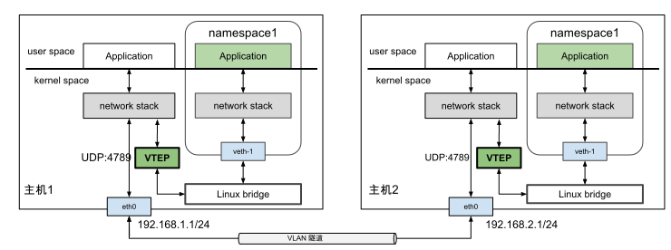

# 3.5.5 虚拟网络通信技术

容器分布在不同的物理主机之上，物理主机通过交换机、路由器等设备互联。

从上述看出，基于物理设备实现的网络拓扑结构是相对固定的，很难跟得上云原生时代下系统频繁变动的频率。例如，容器的动态扩缩容、集群跨数据中心迁移等等，都要求网络拓扑随时做出调整。正因为如此，软件定义网络（Software Defined Networking，SDN）的需求变得前所未有的迫切。

SDN 的核心思想是，在现有的物理网络之上新增一层虚拟网络，将控制平面（操作系统和各类网络控制软件等）和数据平面（底层通信的物理设备，以及各类通信协议等）解耦，将网络服务从底层硬件设备中抽象出来，由代码直接编程控制。

SDN 网络模型如图 3-16 所示：
- 位于下层的网络称 Underlay 网络，它是由路由器、交换机等硬件设备互联而成的物理网络，负责网络之间的数据传输；
- 位于上层的网络称 Overlay 网络，它是采用多种网络虚拟化技术在 Underlay 网络之上创建的虚拟网络。

:::center
  <br/>
  图 3-16 SDN 网络中 Overlay 与 Underlay 网络模型
:::

SDN 的发展要早于云原生十余年，发展过程中出现多种 Overlay 网络的具体实现，如 Geneve（Generic Network Virtualization Encapsulation）、VXLAN（Virtual Extensible LAN）、STT（Stateless Transport Tunneling）等等。这些技术本质上都属于隧道技术，也就是：“将数据包封装在另一个数据包中，在现有物理网络之上创建一个虚拟网络”。

虚拟网络中的容器不需要关心底层物理网络的路由规则等细节，物理网络也不需要针对容器 IP 进行专门路由等配置。因此，以 VXLAN 为代表的 Overlay 网络作为一种无需调底层网络实现的容器组网技术，快速在容器领域铺开了。

学习 VXLAN 之前，有必要充分了解一些物理网络通信的基本原理。接下来，笔者将先介绍 VXLAN 的前身 VLAN（Virtual Local Area Network，虚拟局域网）技术。

## 1. 虚拟局域网 VLAN

基于以太网的通信中，必须在数据帧中指定目标 MAC 地址才能正常通信，因此计算机必须先广播 ARP 请求，获取目标 MAC 地址。假设设备非常多时，ARP、DHCP、RIP 等机制会产生大量的广播帧，很容易形成广播风暴。因此，VLAN 首要职责是划分广播域，一个 VLAN 一个广播域，把连接在同一个物理网络上的设备从逻辑上区分。

各个 VLAN 间无法直接互通，广播报文被限制在一个 VLAN 内。例如，将一个广播域所对应的网段 172.16.0.0/16 分割成 255 个子网，各个子网对应的网段为 172.16.1.0/24、172.16.2.0/24、172.16.3.0/24 ... 172.16.255.0/24，各个子网所对应的 VLAN ID 为 1、2、3 ... 255。如此，每个子网的广播域理论可以容纳 255 个终端，广播风暴的影响指数级下降。

VLAN 划分子网的具体方法是在以太帧的报文头中加入 VLAN Tag，广播只针对具有相同 VLAN Tag 的设备生效。对于支持 VLAN 的交换机，能够识别以太帧内的 VLAN ID，从而确保只有属于相同 VLAN ID 的数据包可以互相转发。

通过 VLAN 划分子网固然可以解决广播风暴的频繁出现，但对那些既希望隔离，又希望某些主机能互通场景来说，划分 VLAN 的同时为不同 VLAN 建立互相访问的通道也是必要的。由于两个 VLAN 之间完全隔离的，不存在重合的广播域，因此它们之间的通信只能通过三层路由设备。

最简单的三层路由模式通过单臂路由实现。单臂路由的网络拓扑如图 3-17 所示。路由器和交换机之间只有一条线路，该线路称 Trunk 链路。与之相对的，主机与交换机之间的链路称 Access 链路。Trunk 链路允许任何 VLAN ID 的数据包通过。需要路由的数据包通过 Trunk 链路到达路由器，路由后原路返回至交换机转发处理。所以大家给这种拓扑起了一个形象的名字 —— 单臂路由。

说白了，单臂路由就是从哪个口进去，再从哪个口出来，而不像传统网络拓扑中数据包从某个接口进入路由器又从另外一个接口离开路由器。为了实现上述中的单臂路由模式，以太网 802.1Q 规范中专门定义了子接口（Sub-Interface）的概念，它的作用是允许在同一张物理网卡上，针对不同的 VLAN 绑定不同的 IP 地址。通过将各子网的默认网关配置为对应的子接口地址，路由器通过修改 VLAN tag，即可实现不同 VLAN 之间跨子网的数据转发。

:::center
  <br/>
  图 3-17 VLAN 单臂路由原理
:::


VLAN 固然通过划分子网的形式解决广播风暴，但它的缺陷也非常明显：
- 第一个缺陷：在于 VLAN Tag 的设计。当时的网络工程师完全未料及云计算会发展得会如此普及，只设计了 12 位 bit 存储 VLAN ID，导致一个 VLAN 子网内的设备数量局限在 4000 个左右，显然无法支持大型数据中心数以万计的设备。
- 第二个缺陷：跨数据中心通信非常麻烦。VLAN 属于二层网络技术，但是两个独立的数据中心之间只能通过三层网络互通。云计算的高速发展下，一个业务跨多个数据中心部署成为普遍需求，数据中心之间传递 VLAN Tag 又是一件麻烦的事情；特别是系统容器化后，一台物理机内运行着数百个容器，每个容器都有独立的 IP 地址和 MAC 地址，带给路由、交换机等设备的压力成倍增加。

## 2. 虚拟可扩展局域网 VXLAN

为了解决上述 VLAN 的设计缺陷，IETF 又新定义了 VXLAN（Virtual eXtensible Local Area Network，虚拟可扩展局域网）规范。

从名字上看，VXLAN 像是 VLAN 的一种扩展协议，但其实 VXLAN 的设计与 VLAN 有着本质的不同。

VXLAN 属于 NVO3（Network Virtualization over Layer 3，三层虚拟化网络）的标准技术规范之一。它实际是一种隧道封装技术，使用 TCP/IP 协议栈中惯用的“封装/解封”手段，将 L2（链路层）以太网帧封装在 L4（传输层）UDP 报文内，然后在 L3（网络层）网络中传输。不同数据中心节点间的通信，就像普通以太网帧在一个广播域中传输一样。

根据图 3-18，我们看到 VXLAN 报文对原始以太网帧（图中的 Original Layer2 Frame）如何封装：

- **VXLAN Header**：其中 24 Bytes 的 VNI 字段，用来定义 VXLAN 网络中不同的租户，它的容量上限是 1,677 万。
- **UDP Header**：UDP 头中目的端口号（图中的 VXLAN Port）固定为 4789，源端口随机分配（通过 MAC、IP 和四层端口号进行 hash 操作）。
- **Outer IP Header**：封装目的 IP 地址和源 IP 地址，这里 IP 指的是宿主机的 IP 地址。
- **Outer MAC Header**：封装源 MAC 地址，目的 MAC 地址，这里 MAC 地址指的是宿主机 MAC 地址。

:::center
  <br/>
  图 3-18 VXLAN 报文结构
:::

在 VXLAN 隧道网络中，负责“封装/解封”的设备称为“VTEP 设备”（VXLAN Tunnel Endpoints，VXLAN 隧道端点），它在 Linux 系统中实际上是一个虚拟 VXLAN 网络接口。当源服务器内的容器发出原始数据帧后，首先在隧道的起点（VTEP 设备）被封装成 VXLAN 格式的报文，然后被主机 IP 网络传递到隧道的终点（也就是目标服务器中的 VTEP 设备）。目标服务器内的 VETP 设备解封 VXLAN 报文，得到原始的数据帧，转发至目标服务器内的某容器。

Linux 内核 3.12 版本起，开始支持完备的 VXLAN 技术（多播模式、单播模式、IPv6 支持等）。只要三层可达的网络，不需要专门的硬件，简单的配置下 Linux 系统，就可以部署 VXLAN 的隧道网络。举一个具体的例子，下面的命令演示了如何在 Linux 系统中配置 VXLAN 接口并将其绑定到 Linux bridge。

```bash
# 创建一个 bridge
$ brctl addbr br0

# 创建一个 VXLAN 接口，VNI 为 100，指定使用 eth0 作为物理接口
$ ip link add vxlan100 type vxlan id 100 dev eth0 dstport 4789

# 将 VXLAN 接口加入 bridge
$ brctl addif br0 vxlan100

# 启动 bridge 和 VXLAN 接口
$ ip link set up dev br0
$ ip link set up dev vxlan100
```
通过上述配置，当 vxlan100 接口接收到数据包（通过 VXLAN 隧道传输而来）时：
- 首先，进行解封操作，移除 VXLAN 头部和 UDP 头部，提取原始的二层以太网帧；
- 然后，将原始二层以太网帧转发至名为 br0 的 Linux bridge，之后 Linux bridge 根据其连接的网络接口转发至某个网络命名空间。

:::center
  <br/>
  图 3-19 VXLAN 通信概览
:::

从上述，我们看到 VXLAN 完美地弥补了 VLAN 的不足：
- 一方面通过 VXLAN 中的 24 bytes VNI 字段（如图 3-25 所示）提供多达 1,677 万租户的标识能力，远大于 VLAN 的 4000；
- 另一方面，VXLAN 本质上在两台交换机之间构建了一条穿越数据中心基础 IP 网络的虚拟隧道，将数据中心网络虚拟成一个巨型“二层交换机”。虚拟机或者容器无论是迁移到 VLAN B 还是 VLAN C，仍然处于同一个二层网络，IP 的配置都不需要任何变化。从此，跨数据中心的服务动态迁移不再是难题。

VXLAN 因其具有很高的灵活性、扩展性和可管理性，已经成为构建数据中心与容器网络的主流技术，绝大多数公有云的 VPC（Virtual Private Cloud，虚拟私有云）和容器网络都是用 VXLAN 技术在一个大二层网络上构建。

本书第七章 7.6 节，笔者将以容器网络解决方案 Flannel 的 VXLAN 模式为例，详细讲解容器网络通信过程及原理。